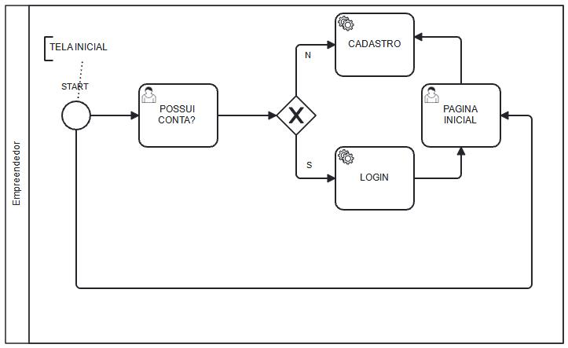
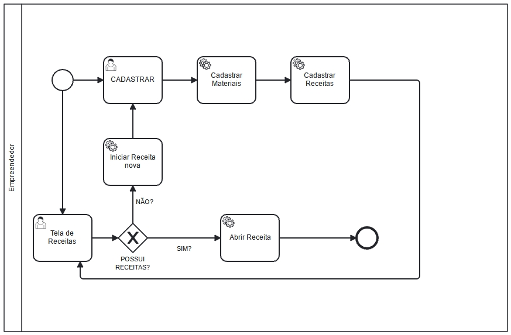
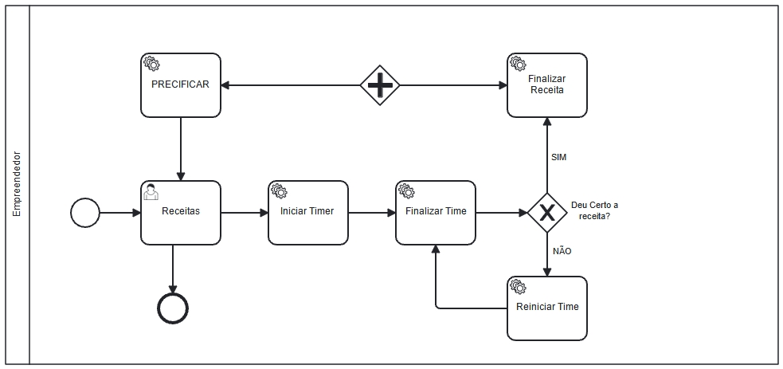

# Especificações do Projeto

A identificação precisa do desafio em questão e os aspectos mais significativos a serem abordados neste empreendimento foram solidificados por meio de um esforço colaborativo com os usuários. Isso foi realizado através de um processo imersivo liderado pela equipe, compreendendo a observação direta dos usuários em suas configurações usuais e a condução de entrevistas interativas. As informações capturadas durante essa exploração foram condensadas e moldadas na forma de personas detalhadas e histórias de usuário.

## Personas

As pessoas retratadas durante o processo de compreensão do problema são apresentadas nas figuras que seguem.

## José Ribeiro

**Profissão:** Recém formado em gastronomia e confeiteiro autônomo; 
**Idade:** 27 anos; 
**Aplicativos:** Whatsapp, Instagram; 
**Motivações:** José recentemente se formou em gastronomia e decidiu se especializar em confeitaria. Ele é apaixonado por criar sobremesas únicas e saborosas. José quer usar suas habilidades para construir sua própria marca e negócio autônomo de confeitaria; 
**Frustrações:** Ele precisa de uma maneira eficiente de rastrear os custos dos ingredientes, gerenciar seu tempo durante a produção e precificar suas criações. Tem o objetivo de usar o aplicativo para melhor gerir seu negócio de confeitaria, garantindo que seus preços reflitam o valor do seu trabalho e que ele possa oferecer produtos de qualidade aos clientes.

---

## Caio Lucas

**Profissão:** Designer gráfico e padeiro amador; 
**Idade:** 24 anos; 
**Aplicativos:** Whatsapp, Twitter, Facebook, Instagram; 
**Motivações:** Caio tem um emprego em tempo integral como designer, mas tem uma paixão por fazer pães e bolos nos fins de semana para vender a amigos, familiares e seus vizinhos. Ele quer levar seu hobby a sério e transformá-lo em uma fonte de renda extra; 
**Frustrações:** Ele precisa de uma maneira simples de acompanhar o tempo gasto em suas produções e calcular o custo dos ingredientes. Tem o objetivo de utilizar o aplicativo para entender quanto tempo ele realmente gasta em cada produto e garantir que seus preços estejam alinhados com o mercado.

---

## Ricardo Silva

**Profissão:** Chef de cozinha autônomo; 
**Idade:** 32 anos; 
**Aplicativos:** Whatsapp, Twitter, Instagram; 
**Motivações:** Ricardo tem anos de experiência na culinária e está agora administrando seu próprio negócio de buffets e venda de pratos gourmet. Ele tem compreensão da importância de calcular os custos corretamente para não comprometer seus possíveis lucros; 
**Frustrações:** Ele precisa de uma maneira eficiente de controlar o tempo gasto na preparação de cada prato e calcular custos dos ingredientes e materiais. Também tem interesse em armazenar receitas e observações sobre cada prato. Tem o objetivo de usar a aplicação para precificar seus pratos de forma justa, garantindo que os custos sejam cobertos e que ele obtenha o lucro desejado.

---

##  Isabela Rodrigues

**Profissão:** Chef de Culinária Artesanal; 
**Idade:** 35 anos; 
**Aplicativos:** Whatsapp, Twitter, Instagram; 
**Motivações:** Isabela está apaixonada por explorar novos sabores e criar pratos únicos. Sua principal motivação é a busca pela expressão artística através da culinária. Ela adora experimentar ingredientes não convencionais e técnicos inovadores; 
**Frustrações:** Isabela muitas vezes se sente frustrada com as limitações de orçamento e recursos. Ela sabe que certos ingredientes e equipamentos de alta qualidade podem elevar suas criações. Tem o objetivo de utilizar o aplicativo para conseguir precificar cada comida artesanal, sem ter prejuízos de acordo com cada ingrediente utilizado.

## Histórias de Usuários

Com base na análise das personas forma identificadas as seguintes histórias de usuários:

|EU COMO... `PERSONA`| QUERO/PRECISO ... `FUNCIONALIDADE` |PARA ... `MOTIVO/VALOR`                 |
|--------------------|------------------------------------|----------------------------------------|
|José Ribeiro (Confeiteiro autônomo)  | Ser capaz de calcular os custos precisos de ingredientes por receita           | Garantir que meus preços cubram os gastos               |
|José Ribeiro (Confeiteiro autônomo)       | Registrar o tempo gasto para produzir cada doce                 | Entender quanto tempo é necessário para cada produto |
|Caio (Padeiro amador)  | Criar perfis de receitas com listas de ingredientes e quantidades           | Calcular os custos de cada prato               |
|Caio (Padeiro amador)       | Registrar o tempo que levo para preparar cada prato                 | Calcular o valor do meu trabalho com base no tempo dedicado |
|Ricardo (Chef de cozinha autônomo)  | Marcar tarefas específicas, como “fermentação” e “tempo de forno”           | Acompanhar o tempo total de preparo               |
|Ricardo (Chef de cozinha autônomo)       | Adicionar notas de aprendizado a cada produção                | Lembrar de ajustes que fiz nas receitas e quais foram os resultados |
| Isabela Rodrigues (Culinária Artesanal)       | Conseguir precificar cada produto | Muitos ingredientes caros e exóticos  |

## Modelagem do Processo de Negócio 

### Análise da Situação Atual

**Na situação atual**, profissionais autônomos, como confeiteiros e artesãos, enfrentam desafios significativos na precificação de seus produtos e serviços. Isso se deve à falta de uma ferramenta eficiente para rastrear custos, calcular preços competitivos e organizar informações sobre projetos e clientes. Muitos dependem de cálculos manuais e estimativas subjetivas, o que pode resultar em precificações incorretas e perda de oportunidades de negócios.

**Considerando o cenário atual**, boa parte das pessoas têm acesso a um computador, notebook, tablet ou smartphone. Nossa proposta é aproveitar o acesso à tecnologia e desenvolver uma aplicação móvel em que os usuários tenham na palma das suas mãos uma forma de resolver esses problemas de forma inovadora, facilitando a gestão financeira, o acompanhamento de receitas e a apresentação profissional do trabalho para profissionais autônomos.

### Descrição Geral da Proposta

**A proposta** consiste na criação de um aplicativo voltado para profissionais autônomos para resolver os desafios críticos relacionados à precificação manual de produtos e serviços, gestão de custos e organização de informações comerciais. O aplicativo abrangerá desde o cálculo preciso de custos até a geração automática de preços competitivos, possibilitando que os usuários mantenham registros detalhados de seus projetos, incluindo receitas para atrair clientes.

Esta proposta **está alinhada com os objetivos** de capacitar profissionais autônomos a tomar decisões informadas e estratégicas em relação à precificação, tornando-os mais competitivos e eficazes na promoção de seus serviços. O Cooklator, ao fornecer uma maneira mais eficaz de calcular custos, rastrear tempo e organizar informações, tem o potencial de revolucionar a maneira como os profissionais autônomos gerenciam seus negócios. Além disso, pode ajudar a nivelar o campo de jogo, permitindo que esses profissionais compitam de maneira mais justa e eficaz no mercado, proporcionando benefícios tangíveis à sua carreira e ao sucesso de seus empreendimentos.

**As oportunidades de melhoria** incluem a expansão do Cooklator para atender a diversas profissões autônomas, bem como a adição de recursos avançados, como análises de mercado e integração com sistemas de pagamento. Ao resolver desafios existentes e fornecer ferramentas abrangentes para a gestão de negócios autônomos, esta proposta tem o potencial de se tornar uma solução indispensável para profissionais que buscam sucesso e crescimento em seus empreendimentos.

### Processo 1 – TELA INICIAL

Aqui apresenta, tela de Login, e Cadastro de usuário, mostrando o modelo de  processo  1, descrito no padrão BPMN. 

### Processo 2 – TELA DE RECEITAS.

Aqui apresenta a tela de cadastro de todo o material , a receita e afins que será utilizado durante toda a receita  , mostrando o modelo de  processo  2, descrito no padrão BPMN.

### Processo 3 – TELA DE PRECIFICAÇÃO.

Aqui apresenta a tela de trabalho, utilizada para usar a calculadora, com finalidade de precificar o produto para o usuário , mostrando o modelo de  processo  3, descrito no padrão BPMN.

## Indicadores de Desempenho

Também conhecidos como KPIs (Key Performance Indicators), os indicadores de desempenho no cenário de planejamento de projetos são ferramentas essenciais, com a finalidade de avaliar e monitorar o andamento de um ou mais processos. Qualquer indicador de desempenho existe como métrica, sendo que o tipo mais indicado dependerá das metas estabelecidas no decorrer da estratégia.

Fonte: PIRES, Raphael. Rock Content, 2020.

| Indicador | Objetivos | Descrição | Cálculo | Fonte de Dados | Perspectiva |
|-------------|-------------|-------------|-------------|-------------|-------------|
| Taxa de Precificação | Garantir preços competitivos | Avalia  a precisão dos preços calculados em relação ao mercado | {(Preço Proposto - Preço de Mercado) / Preço de Mercado} x 100 | Dados de preços de mercado, dados de custos do aplicativo | Financeira |
| Eficiência de Custos | Minimizar gastos excessivos | Avalia a eficiência na gestão de custos e materiais | {(Custo Real - Custo Estimado) / Custo Estimado} x 100 | Dados de custos do aplicativo | Operacional |
| Tempo Médio de Produção | Melhorar a eficiência da produção | Calcula o tempo médio gasto na produção de cada item | Soma do tempo de produção de todos os itens / Número de itens produzidos | Dados de tempo do aplicativo | Operacional |
| Taxa de Conversão de Vendas | Aumentar a taxa de conversão de vendas | Mede a porcentagem de clientes que fazem uma compra após visualizar o receitas e/ou portfólio digital| (Número de compras / Número de visualizações) x 100 | Dados de interação das receitas e/ou portfólio digital | Comercial |
| Satisfação do Usuário | Melhorar a experiência do usuário | Avalia a satisfação dos usuários com o aplicativo | Média das avaliações de satisfação fornecidas pelos usuários | Avaliações de usuários | Qualitativa |

## Requisitos

As tabelas a seguir apresentam os requisitos funcionais, requisitos não funcionais e restrições que definem o escopo do projeto. O levantamento da prioridade dos requisitos foi definida por meio da técnica de Escala de Três Níveis. Os critérios de importância e urgência foram utilizados como níveis de prioridade em um quadrante, possibilitando a combinação destes aspectos durante a classificação da prioridade de cada requisito.

### Requisitos Funcionais

|ID    | Descrição do Requisito  | Prioridade | 
|------|-----------------------------------------|----|
|RF-001| A aplicação permitirá ao usuário realizar cadastro para ter acesso a plataforma | ALTA | 
|RF-002| A aplicação permitirá ao usuário o acesso a plataforma com os dados cadastrados | ALTA |
|RF-003| A aplicação permitirá o cadastro de materiais e insumos para controle e cálculos de quantidade e gastos pelo usuário | MÉDIA |
|RF-004| A aplicação deve permitir o usuário utilizar o timer para o cálculo do tempo gasto para confecção do produto | ALTA |
|RF-005| A aplicação deve permitir ao usuário o cadastro e exibição das receitas e precificação na plataforma | ALTA |
|RF-006| A aplicação deve permitir a edição dos dados referentes aos insumos e receitas do usuário | MÉDIA |
|RF-007| A aplicação deve permitir a edição de dados de conta do usuário | BAIXA |
|RF-008| A aplicação deve permitir a recuperação ou mudança de senha | BAIXA |

### Requisitos não Funcionais

|ID     | Descrição do Requisito  |Prioridade |
|-------|-------------------------|----|
|RNF-001| A aplicação deverá ser responsiva permitindo a visualização em aparelhos mobile de forma adequada. | MÉDIA | 
|RNF-002| A aplicação deve responder em um tempo de até 500ms as suas requisições |  ALTA | 

## Restrições

O projeto está restrito pelos itens apresentados na tabela a seguir.

|ID| Restrição                                             |
|--|-------------------------------------------------------|
|01| O projeto deve ser entregue até o final do semestre 2023.2 |
|02| A aplicação deverá ser desenvolvida utilizando React Native e JSON Server |
|03| Apenas a própria equipe será responsável pelo desenvolvimento do projeto. |
|04| O projeto fará uso de um banco de dados relacional.|

## Diagrama de Casos de Uso

# Matriz de Rastreabilidade

A matriz de rastreabilidade é uma ferramenta usada para facilitar a visualização dos relacionamento entre requisitos e outros artefatos ou objetos, permitindo a rastreabilidade entre os requisitos e os objetivos de negócio. 

| ID | RF01 | RF02 | RF03 | RF04 | RF05 |
|----|------|------|------|------|------|
|RF01|      |  x   |      |      |      |
|RF02|  x   |  x   |  x   |  x   |  x   |
|RF03|      |  x   |      |  x   |  x   |
|RF04|      |  x   |  x   |      |      |
|RF05|      |  x   |  x   |      |      |

# Gerenciamento de Projeto

De acordo com o PMBoK v6 as dez áreas que constituem os pilares para gerenciar projetos, e que caracterizam a multidisciplinaridade envolvida, são: Integração, Escopo, Cronograma (Tempo), Custos, Qualidade, Recursos, Comunicações, Riscos, Aquisições, Partes Interessadas. Para desenvolver projetos um profissional deve se preocupar em gerenciar todas essas dez áreas. Elas se complementam e se relacionam, de tal forma que não se deve apenas examinar uma área de forma estanque. É preciso considerar, por exemplo, que as áreas de Escopo, Cronograma e Custos estão muito relacionadas. Assim, se eu amplio o escopo de um projeto eu posso afetar seu cronograma e seus custos.

## Gerenciamento de Tempo

Com diagramas bem organizados que permitem gerenciar o tempo nos projetos, o gerente de projetos agenda e coordena tarefas dentro de um projeto para estimar o tempo necessário de conclusão.

O gráfico de Gantt ou diagrama de Gantt também é uma ferramenta visual utilizada para controlar e gerenciar o cronograma de atividades de um projeto. Com ele, é possível listar tudo que precisa ser feito para colocar o projeto em prática, dividir em atividades e estimar o tempo necessário para executá-las.

## Gerenciamento de Equipe

O gerenciamento adequado de tarefas contribuirá para que o projeto alcance altos níveis de produtividade. Por isso, é fundamental que ocorra a gestão de tarefas e de pessoas, de modo que os times envolvidos no projeto possam ser facilmente gerenciados. 

## Gestão de Orçamento

O processo de determinar o orçamento do projeto é uma tarefa que depende, além dos produtos (saídas) dos processos anteriores do gerenciamento de custos, também de produtos oferecidos por outros processos de gerenciamento, como o escopo e o tempo. Os cálculos foram realizados considerando custos correspondentes à uma equipe de 06 (seis) integrantes.

|Recursos Necessários | Custo estimado (R$)                |
|--|-------------------------------------------------------|
| Hardware |  R$30.000 |
| Publicidade e Marketing |  R$15.000 |
| Recursos Humanos | R$180.000 |
| Rede |  R$5.000 |]
| Software |  R$30.000 |
| Serviços |  R$7.000 |
| **TOTAL** |  R$267.000 |
