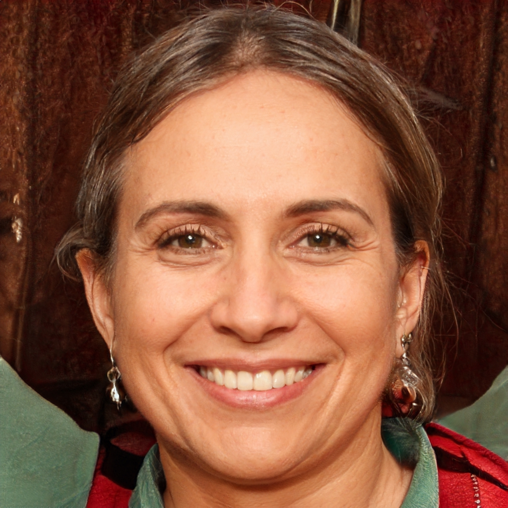
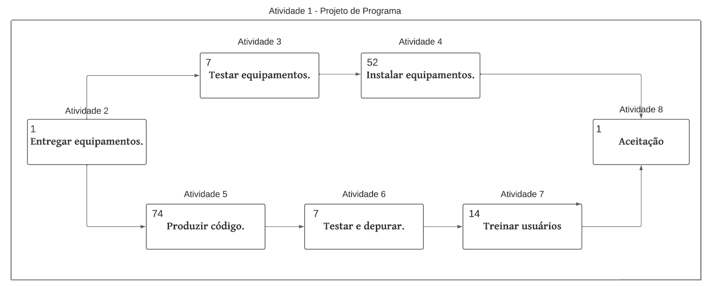
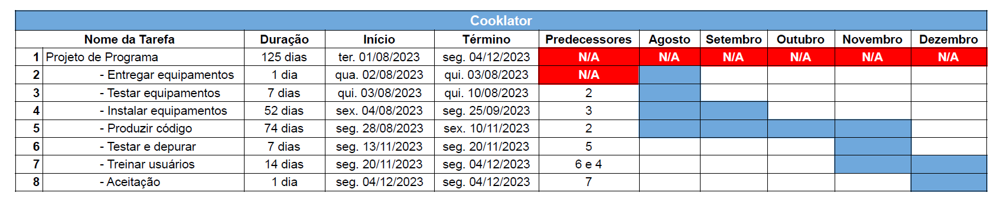
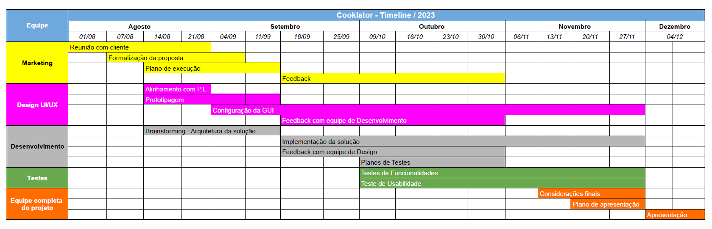

# Especificações do Projeto

## Personas

As pessoas retratadas durante o processo de compreensão do problema são apresentadas nas figuras que seguem.

## José Ribeiro

**Profissão:** Recém formado em gastronomia e confeiteiro autônomo; 
**Idade:** 27 anos; 
**Aplicativos:** Whatzapp , Instagram; 
**Motivações:** José recentemente se formou em gastronomia e decidiu se especializar em confeitaria. Ele é apaixonado por criar sobremesas únicas e saborosas. José quer usar suas habilidades para construir sua própria marca e negócio autônomo de confeitaria; 
**Frustações:** Ele precisa de uma maneira eficiente de rastrear os custos dos ingredientes, gerenciar seu tempo durante a produção e precificar suas criações. Tem o objetivo de usar o aplicativo para melhor gerir seu negócio de confeitaria, garantindo que seus preços reflitam o valor do seu trabalho e que ele possa oferecer produtos de qualidade aos clientes.

---

## Caio Lucas

**Profissão:** Designer gráfico e padeiro amador; 
**Idade:** 24 anos; 
**Aplicativos:** Whatzapp, twitter, facebook, Instagram; 
**Motivações:** Caio tem um emprego em tempo integral como designer, mas tem uma paixão por fazer pães e bolos nos fins de semana para vender a amigos, familiares e seus vizinhos. Ele quer levar seu hobby a sério e transformá-lo em uma fonte de renda extra; 
**Frustações:** Ele precisa de uma maneira simples de acompanhar o tempo gasto em suas produções e calcular o custo dos ingredientes. Tem o objetivo de utilizar o aplicativo para entender quanto tempo ele realmente gasta em cada produto e garantir que seus preços estejam alinhados com o mercado.

---

## Ricardo Silva

**Profissão:** Chef de cozinha autônomo; 
**Idade:** 32 anos; 
**Aplicativos:** Whatzapp, twitter, Instagram; 
**Motivações:** Ricardo tem anos de experiência na culinária e está agora administrando seu próprio negócio de buffets e venda de pratos gourmet. Ele tem compreensão da importância de calcular os custos corretamente para não comprometer seus possíveis lucros; 
**Frustações:** Ele precisa de uma maneira eficiente de controlar o tempo gasto na preparação de cada prato e calcular custos dos ingredientes e materiais. Também tem interesse em armazenar receitas e observações sobre cada prato. Tem o objetivo de usar a aplicação para precificar seus pratos de forma justa, garantindo que os custos sejam cobertos e que ele obtenha o lucro desejado.

---

##  Isabela Rodrigues

**Profissão:** Chef de Culinária Artesanal; 
**Idade:** 35 anos; 
**Aplicativos:** Whatzapp, twitter, Instagram; 
**Motivações:** Isabela está apaixonada por explorar novos sabores e criar pratos únicos. Sua principal motivação é a busca pela expressão artística através da culinária. Ela adora experimentar ingredientes não convencionais e técnicos inovadores; 
**Frustações:** Isabela muitas vezes se sente frustrada com as limitações de orçamento e recursos. Ela sabe que certos ingredientes e equipamentos de alta qualidade podem elevar suas criações.Tem o objetivo de utilizar o aplicativo para conseguir precificar cada comida artesanal, sem ter prejuízos de acordo com cada ingrediente utilizado .

## Histórias de Usuários

Com base na análise das personas forma identificadas as seguintes histórias de usuários:

|EU COMO... `PERSONA`| QUERO/PRECISO ... `FUNCIONALIDADE` |PARA ... `MOTIVO/VALOR`                 |
|--------------------|------------------------------------|----------------------------------------|
|José Ribeiro (Confeiteiro autônomo)  | Ser capaz de calcular os custos precisos de ingredientes por receita           | Garantir que meus preços cubram os gastos               |
|José Ribeiro (Confeiteiro autônomo)       | Registrar o tempo gasto para produzir cada doce                 | Entender quanto tempo é necessário para cada produto |
|Caio (Padeiro amador)  | Criar perfis de receitas com listas de ingredientes e quantidades           | Calcular os custos de cada prato               |
|Caio (Padeiro amador)       | Registrar o tempo que levo para preparar cada prato                 | Calcular o valor do meu trabalho com base no tempo dedicado |
|Ricardo (Chef de cozinha autônomo)  | Marcar tarefas específicas, como “fermentação” e “tempo de forno”           | Acompanhar o tempo total de preparo               |
|Ricardo (Chef de cozinha autônomo)       | Adicionar notas de aprendizado a cada produção                | Lembrar de ajustes que fiz nas receitas e quais foram os resultados |
| Isabela Rodrigues (Culinária Artesanal)       | Conseguir precificar cada produto | Muitos ingredientes caros e exoticos  |

## Modelagem do Processo de Negócio 

### Análise da Situação Atual

Apresente aqui os problemas existentes que viabilizam sua proposta. Apresente o modelo do sistema como ele funciona hoje. Caso sua proposta seja inovadora e não existam processos claramente definidos, apresente como as tarefas que o seu sistema pretende implementar são executadas atualmente, mesmo que não se utilize tecnologia computacional. 

### Descrição Geral da Proposta

Apresente aqui uma descrição da sua proposta abordando seus limites e suas ligações com as estratégias e objetivos do negócio. Apresente aqui as oportunidades de melhorias.

### Processo 1 – NOME DO PROCESSO

Apresente aqui o nome e as oportunidades de melhorias para o processo 1. Em seguida, apresente o modelo do processo 1, descrito no padrão BPMN. 

### Processo 2 – NOME DO PROCESSO

Apresente aqui o nome e as oportunidades de melhorias para o processo 2. Em seguida, apresente o modelo do processo 2, descrito no padrão BPMN.

## Indicadores de Desempenho

Apresente aqui os principais indicadores de desempenho e algumas metas para o processo. Atenção: as informações necessárias para gerar os indicadores devem estar contempladas no diagrama de classe. Colocar no mínimo 5 indicadores. 

Usar o seguinte modelo: 

Obs.: todas as informações para gerar os indicadores devem estar no diagrama de classe a ser apresentado a posteriori. 

## Requisitos

As tabelas que se seguem apresentam os requisitos funcionais e não funcionais que detalham o escopo do projeto. Para determinar a prioridade de requisitos, aplicar uma técnica de priorização de requisitos e detalhar como a técnica foi aplicada.

### Requisitos Funcionais

|ID    | Descrição do Requisito  | Prioridade | 
|------|-----------------------------------------|----|
|RF-001| A aplicação permitirá ao usuário realizar cadastro para ter acesso a plataforma | ALTA | 
|RF-002| A aplicação permitirá ao usuário o acesso a plataforma com os dados cadastrados | ALTA |
|RF-003| A aplicação permitirá o cadastro de materiais e insumos para controle e cálculos de quantidade e gastos pelo usuário | MÉDIA |
|RF-004| A aplicação deve permitir o usuário utilizar o timer para o cálculo do tempo gasto para confecção do produto | ALTA |
|RF-005| A aplicação deve permitir ao usuário o cadastro e exibição dos pratos e receitas na plataforma | MÉDIA |
|RF-006| A aplicação deve permitir a edição dos dados referentes aos insumos e receitas do usuário | MÉDIA |
|RF-007| A aplicação deve permitir a edição de dados de conta do usuário | BAIXA |
|RF-008| A aplicação deve permitir a recuperação ou mudança de senha | BAIXA |

### Requisitos não Funcionais

|ID     | Descrição do Requisito  |Prioridade |
|-------|-------------------------|----|
|RNF-001| A aplicação deverá ser responsiva permitindo a visualização em aparelhos mobile de forma adequada. | MÉDIA | 
|RNF-002| A aplicação deve responder em um tempo de até 500ms as suas requisições |  ALTA | 

Com base nas Histórias de Usuário, enumere os requisitos da sua solução. Classifique esses requisitos em dois grupos:

- [Requisitos Funcionais
 (RF)](https://pt.wikipedia.org/wiki/Requisito_funcional):
 correspondem a uma funcionalidade que deve estar presente na
  plataforma (ex: cadastro de usuário).
- [Requisitos Não Funcionais
  (RNF)](https://pt.wikipedia.org/wiki/Requisito_n%C3%A3o_funcional):
  correspondem a uma característica técnica, seja de usabilidade,
  desempenho, confiabilidade, segurança ou outro (ex: suporte a
  dispositivos iOS e Android).
Lembre-se que cada requisito deve corresponder à uma e somente uma
característica alvo da sua solução. Além disso, certifique-se de que
todos os aspectos capturados nas Histórias de Usuário foram cobertos.

## Restrições

O projeto está restrito pelos itens apresentados na tabela a seguir.

|ID| Restrição                                             |
|--|-------------------------------------------------------|
|01| O projeto deve ser entregue até o final do semestre 2023.2 |

Enumere as restrições à sua solução. Lembre-se de que as restrições geralmente limitam a solução candidata.

> **Links Úteis**:
> - [O que são Requisitos Funcionais e Requisitos Não Funcionais?](https://codificar.com.br/requisitos-funcionais-nao-funcionais/)
> - [O que são requisitos funcionais e requisitos não funcionais?](https://analisederequisitos.com.br/requisitos-funcionais-e-requisitos-nao-funcionais-o-que-sao/)

## Diagrama de Casos de Uso

O diagrama de casos de uso é o próximo passo após a elicitação de requisitos, que utiliza um modelo gráfico e uma tabela com as descrições sucintas dos casos de uso e dos atores. Ele contempla a fronteira do sistema e o detalhamento dos requisitos funcionais com a indicação dos atores, casos de uso e seus relacionamentos. 

As referências abaixo irão auxiliá-lo na geração do artefato “Diagrama de Casos de Uso”.

> **Links Úteis**:
> - [Criando Casos de Uso](https://www.ibm.com/docs/pt-br/elm/6.0?topic=requirements-creating-use-cases)
> - [Como Criar Diagrama de Caso de Uso: Tutorial Passo a Passo](https://gitmind.com/pt/fazer-diagrama-de-caso-uso.html/)
> - [Lucidchart](https://www.lucidchart.com/)
> - [Astah](https://astah.net/)
> - [Diagrams](https://app.diagrams.net/)

# Matriz de Rastreabilidade

| ID | RF01 | RF02 | RF03 | RF04 | RF05 |
|----|------|------|------|------|------|
|RF01|      |  x   |      |      |      |
|RF02|  x   |  x   |  x   |  x   |  x   |
|RF03|      |  x   |      |  x   |  x   |
|RF04|      |  x   |  x   |      |      |
|RF05|      |  x   |  x   |      |      |

A matriz de rastreabilidade é uma ferramenta usada para facilitar a visualização dos relacionamento entre requisitos e outros artefatos ou objetos, permitindo a rastreabilidade entre os requisitos e os objetivos de negócio. 

A matriz deve contemplar todos os elementos relevantes que fazem parte do sistema, conforme a figura meramente ilustrativa apresentada a seguir.

> **Links Úteis**:
> - [Artigo Engenharia de Software 13 - Rastreabilidade](https://www.devmedia.com.br/artigo-engenharia-de-software-13-rastreabilidade/12822/)
> - [Verificação da rastreabilidade de requisitos usando a integração do IBM Rational RequisitePro e do IBM ClearQuest Test Manager](https://developer.ibm.com/br/tutorials/requirementstraceabilityverificationusingrrpandcctm/)
> - [IBM Engineering Lifecycle Optimization – Publishing](https://www.ibm.com/br-pt/products/engineering-lifecycle-optimization/publishing/)

# Gerenciamento de Projeto

De acordo com o PMBoK v6 as dez áreas que constituem os pilares para gerenciar projetos, e que caracterizam a multidisciplinaridade envolvida, são: Integração, Escopo, Cronograma (Tempo), Custos, Qualidade, Recursos, Comunicações, Riscos, Aquisições, Partes Interessadas. Para desenvolver projetos um profissional deve se preocupar em gerenciar todas essas dez áreas. Elas se complementam e se relacionam, de tal forma que não se deve apenas examinar uma área de forma estanque. É preciso considerar, por exemplo, que as áreas de Escopo, Cronograma e Custos estão muito relacionadas. Assim, se eu amplio o escopo de um projeto eu posso afetar seu cronograma e seus custos.

## Gerenciamento de Tempo

Com diagramas bem organizados que permitem gerenciar o tempo nos projetos, o gerente de projetos agenda e coordena tarefas dentro de um projeto para estimar o tempo necessário de conclusão.

O gráfico de Gantt ou diagrama de Gantt também é uma ferramenta visual utilizada para controlar e gerenciar o cronograma de atividades de um projeto. Com ele, é possível listar tudo que precisa ser feito para colocar o projeto em prática, dividir em atividades e estimar o tempo necessário para executá-las.

## Gerenciamento de Equipe

O gerenciamento adequado de tarefas contribuirá para que o projeto alcance altos níveis de produtividade. Por isso, é fundamental que ocorra a gestão de tarefas e de pessoas, de modo que os times envolvidos no projeto possam ser facilmente gerenciados. 

## Gestão de Orçamento

O processo de determinar o orçamento do projeto é uma tarefa que depende, além dos produtos (saídas) dos processos anteriores do gerenciamento de custos, também de produtos oferecidos por outros processos de gerenciamento, como o escopo e o tempo. Os cálculos foram realizados considerando custos correspondentes à uma equipe de 06 (seis) integrantes.

|Recursos Necessários | Custo estimado (R$)                |
|--|-------------------------------------------------------|
| Hardware |  R$30.000 |
| Publicidade e Marketing |  R$15.000 |
| Recursos Humanos | R$180.000 |
| Rede |  R$5.000 |]
| Software |  R$30.000 |
| Serviços |  R$7.000 |
| **TOTAL** |  R$267.000 |
