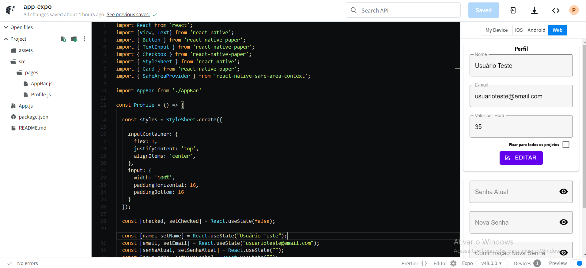
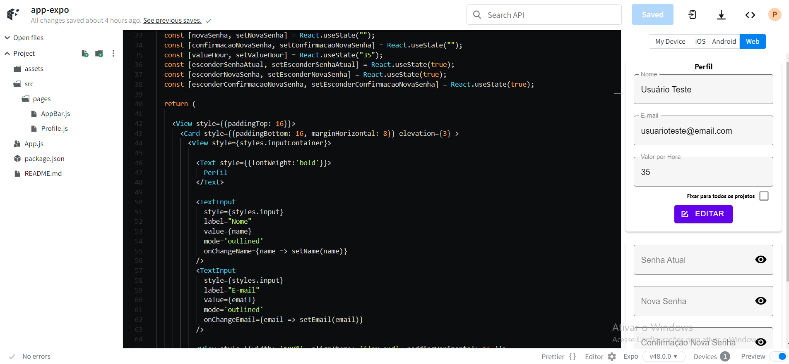
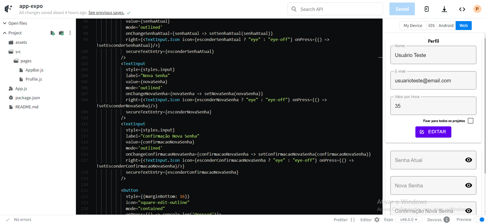
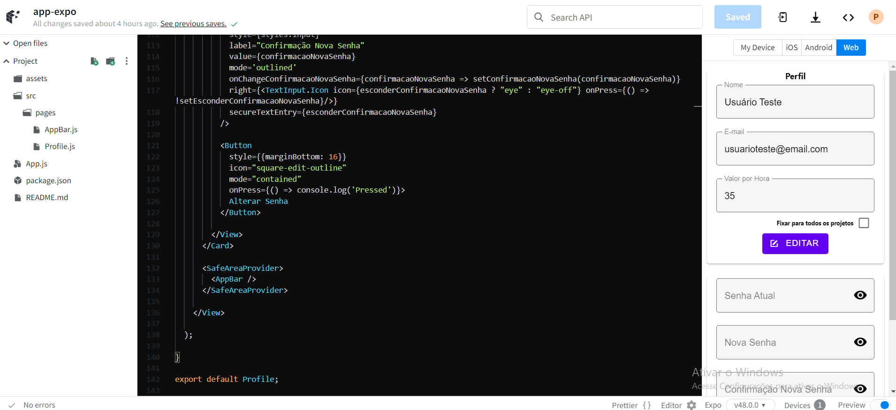

# Programação de Funcionalidades

Nesta seção são apresentadas as implementações iniciais das diversas telas que irão compor o sistema e serão a interface para as diversas funcionalidades do mesmo.

## Tela de Perfil (Pedro Mota Cassemiro)

Na tela de perfil há duas seções distintas. A primeira seção irá apresentar ao usuário os seus dados. Os dados são: "Nome", "E-mail" e "Valor por Hora". Cada um desses dados é apresentado como um "input" preenchido com os valores correspondentes. Abaixo do campo "valor por hora" há um "checkbox" que indica se o valor definido para "Valor por Hora" será usado em todos os projetos desenvolvidos. Logo abaixo, ao final da primeira seção, o usuário poderá confirma as alterações realizadas em todos esses campos ao clicar no botão "Editar".

A segunda seção irá permitir ao usuário alterar sua senha de login. A alteração poderá ser realizada por meio de três campos, sendo eles: "Senha atual", "Nova senha" e "Confirmação de Nova Senha". O campo "Senha atual" é de grande importância pois permite que haja uma segunda verificação em relação ao usuário em posse do dispositivo móvel e com acesso à tela de perfil. Assim, um segundo usuário, ao obter acesso à tela de perfil, independente da circunstância, não será capaz de alterar a senha da conta. O usuário legítimo deverá inserir a senha atual para assim validar a alteração desejada. O campo "Confirmação Nova Senha" é uma simples maneira de auxiliar o usuário na confirmação de sua escolha. Os três campos apresentam um ícone à direita que permitirá a exibição dos valores inseridos nos campos caso sejam acionados. Ao final da seção, há o botão "Alterar Senha" que ao ser acionado irá validar os dados inseridos.

O código define estilos para os elementos na tela, como input fields (campos de entrada), botões, e cards. Esses estilos são criados usando StyleSheet.create e serão usados para estilizar os componentes na tela.

O código utiliza o hook useState do React para criar vários estados. Os estados incluem checked para controlar o checkbox "Valor por Hora", "name" para armazenar o nome do usuário, "email" para armazenar o e-mail, "senhaAtual" para armazenar a senha atual, "novaSenha" para armazenar a nova senha, "confirmacaoNovaSenha" para armazenar a confirmação da nova senha, "valueHour" para armazenar o valor por hora do usuário, e estados booleanos para controlar a visibilidade da senha atual, nova senha e confirmação de nova senha.

A interface é renderizada dentro de um componente View. Ela consiste em dois cards, cada um contendo campos de entrada e botões.
O primeiro card é para as informações pessoais, nome, e-mail e valor por hora. Um botão "Editar" é fornecido, mas atualmente, ele apenas imprime uma mensagem no console quando pressionado. O segundo card é para alteração de senha. Ele inclui campos para a senha atual, nova senha e confirmação da nova senha. Cada campo de senha é configurado para ocultar ou mostrar a senha atual e as novas senhas, conforme desejado. Há também um botão "Alterar Senha", que ainda não executa nenhuma ação além de imprimir uma mensagem no console nessa implementação inicial.

## Tela de Cadastro de Materiais (Juliana Dutra Moreira)

O cadastro de receitas permitirá o usuário fazer o registro inicial da receita com nome, observações e materiais que serão utilizados no desenvolvimento do prato. Estas informações após cadastradas serão exibidas quando o usuário iniciar a receita e serão utilizada para registros e cálculos posteriores relacionados a receita. Nesta tela o usuário poderá colocar um nome desejado no input Nome, inserir observações no input Observações e poderá cadastrar materiais por meio do botão "+", no qual será encaminhado para o modal/tela de cadastro de material. Esses materiais serão listados nesta tela a medida que o usuário cadastra novos materiais. Ao final, por meio dos botões "Salvar" ou "Cancelar" ele poderá optar pelo registro da receita ou cancelamento para retornar a página de receitas. 

No código atual, é possível adicionar um nome, observação e adicionar materiais que serão listados na tela. A adição de materiais está de forma representativa pois esta funcionalidade será desenvolvida de modo separado ao cadastro de material. Os botões ao final da página ainda não executam as funções.

