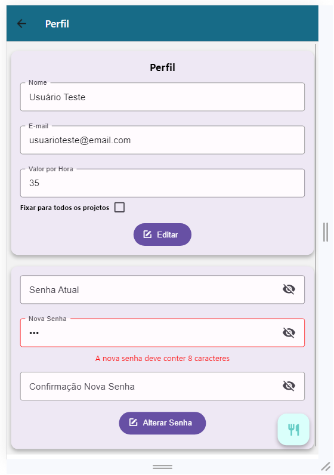

# Programação de Funcionalidades

Nesta seção são apresentadas as implementações iniciais das diversas telas que irão compor o sistema e serão a interface para as diversas funcionalidades do mesmo.

## Tela de Perfil (Pedro Mota Cassemiro)

Na tela de perfil há duas seções distintas. A primeira seção irá apresentar ao usuário os seus dados. Os dados são: "Nome", "E-mail" e "Valor por Hora". Cada um desses dados é apresentado como um "input" preenchido com os valores correspondentes. Abaixo do campo "valor por hora" há um "checkbox" que indica se o valor definido para "Valor por Hora" será usado em todos os projetos desenvolvidos. Logo abaixo, ao final da primeira seção, o usuário poderá confirma as alterações realizadas em todos esses campos ao clicar no botão "Editar".

A segunda seção irá permitir ao usuário alterar sua senha de login. A alteração poderá ser realizada por meio de três campos, sendo eles: "Senha atual", "Nova senha" e "Confirmação de Nova Senha". O campo "Senha atual" é de grande importância pois permite que haja uma segunda verificação em relação ao usuário em posse do dispositivo móvel e com acesso à tela de perfil. Assim, um segundo usuário, ao obter acesso à tela de perfil, independente da circunstância, não será capaz de alterar a senha da conta. O usuário legítimo deverá inserir a senha atual para assim validar a alteração desejada. O campo "Confirmação Nova Senha" é uma simples maneira de auxiliar o usuário na confirmação de sua escolha. Os três campos apresentam um ícone à direita que permitirá a exibição dos valores inseridos nos campos caso sejam acionados. Ao final da seção, há o botão "Alterar Senha" que ao ser acionado irá validar os dados inseridos.

O nome de usuário deverá conter entre 5 e 15 caracteres. Ao inserir um nome que não está nesse intervalo, um texto em vermelho com a exigência do número de caracteres irá aparecer, além do contorno do campo também se tornar vermelho.

Ao inserir um endereço de e-mail inválido, também irá ser aparesentado ao usuário um texto em vermelho indicando que o e-mail inserido não é válido, além do destaque vermelho no contorno do campo.

A nova senha, deverá conter 8 caracteres. A inserção de uma nova senha que não possua esse número de caracteres irá apresentar para o usuário um texto em vermelho com a exigência descrita e o contorno do campo também se tornará vermelho.

Caso não seja inserido no campo "Confirmação de nova senha", o mesmo valor do campo "Nova Senha", um aviso em vermelho irá indicar que a confirmação de nova senha é inválida, além do contorno do campo se tornar vermelho.

O código define estilos para os elementos na tela, como input fields (campos de entrada), botões, e cards. Esses estilos são criados usando StyleSheet.create e serão usados para estilizar os componentes na tela.

O código utiliza o hook useState do React para criar vários estados. Os estados incluem checked para controlar o checkbox "Valor por Hora", "name" para armazenar o nome do usuário, "email" para armazenar o e-mail, "senhaAtual" para armazenar a senha atual, "novaSenha" para armazenar a nova senha, "confirmacaoNovaSenha" para armazenar a confirmação da nova senha, "valueHour" para armazenar o valor por hora do usuário, e estados booleanos para controlar a visibilidade da senha atual, nova senha e confirmação de nova senha.

Além disso, há também as variáveis de validação dos campos "name", "e-mail", "newPassword" e "newPasswordConfirmation". Essas variáveis são, respectivamente: "isNameValid", "isEmailValid", "isNewPasswordValid" e "isNewPasswordConfirmationValid".

A interface é renderizada dentro de um componente View. Ela consiste em dois cards, cada um contendo campos de entrada e botões.
O primeiro card é para as informações pessoais, nome, e-mail e valor por hora. Um botão "Editar" é fornecido, mas atualmente, ele apenas imprime uma mensagem no console quando pressionado. O segundo card é para alteração de senha. Ele inclui campos para a senha atual, nova senha e confirmação da nova senha. Cada campo de senha é configurado para ocultar ou mostrar a senha atual e as novas senhas, conforme desejado. Há também um botão "Alterar Senha", que ainda não executa nenhuma ação além de imprimir uma mensagem no console nessa implementação inicial.

Nas imagens acima, é possível observar as funções chamadas com o evento de preenchimento dos diversos campos da página. Nelas há a validação dos dados, a alteração das variáveis de validação e das variáveis que irão armazenar os dados informados pelo usuário, caso sejam válidos.Também é possível observar a expressão regular utilizada para verificar a validade do endereço de e-mail inserido pelo usuário: 
 
<strong>"^"</strong>: Representa o início da string, garantindo que a correspondência comece desde o início. 
<strong>"[^\s@]+"</strong>: Corresponde a um ou mais caracteres que não são espaços em branco (\s) nem o símbolo "@". 
<strong>"@"</strong>: Corresponde literalmente ao símbolo "@". 
<strong>"[^\s@]+"</strong>: Outra vez, corresponde a um ou mais caracteres que não são espaços em branco (\s) nem o símbolo "@". 
<strong>"\."</strong>: Corresponde literalmente a um ponto (.) — usado para separar o nome de domínio da parte do domínio de nível superior 
<strong>"[^\s@]+$"</strong>: Corresponde a um ou mais caracteres que não são espaços em branco (\s) nem o símbolo "@", no final da string ($ indica o final da string). 

Nas imagens acima, é possível observar a lógica utilizada para acessar os valores das variáveis de validação e de acordo com o seu valor booleano, alterar o estilo do input e apresentar ou não a mensagem de validação correspondente a cada campo da tela.

## Tela de Cadastro de Receitas (Juliana Dutra Moreira)

O cadastro de receitas permitirá ao usuário fazer o registro inicial da receita com nome, observações, valor da hora e cadastrar também, os  materiais que serão utilizados no desenvolvimento do prato. O usuário poderá escolher entre cadastrar o valor da hora usando o valor geral estipulado no cadastro (e exibido na tela de perfil) ou então, colocar o valor desejado no input. Para identificar melhor a receita, o usuário poderá também escolher uma cor a qual será exibida nos cards das receitas. Caso o usuário não selecione, uma cor padrão será atribuída à receita.

O usuário deverá, obrigatoriamente, inserir um nome e um valor à receita. Caso ele deixe de preencher estes campos, será impedido de salvar e prosseguir, e além disso, alertas de preenchimento serão exibidos na tela.

Ao clicar em "Salvar", uma mensagem de sucesso será exibida e o usuário poderá optar por ir para a página inicial ou cadastrar outra receita. Após esta ação, a requisição para o backend é realizada e a receita é armazenada no banco de dados.

Todas as funcionalidades citadas acima já estão aplicadas, faltando apenas a integração com o cadastro de materiais e a listagem destes.

## TELA DE LOGIN E CADASTRO (HECTOR FLORENÇA)

O Tela de Login  permitirá o usuário fazer o ‘Login’ utilizando Email e Senhas, será método para ele acessar todos as suas receitas ja salvas, e também salvar novas receitas, a tela contara como uma rota de acesso para CADASTRAR caso o usuário não tenha ainda uma conta no nosso aplicativo, caso o usuário coloque senha ou Email errado retornara uma mensagem de erro , se não mesmo ira retorna para pagina Home.
Na tela de Cadastro, caso o usuário não tenha cadastrado antes, mesmo poderá criar nova conta utilizando Nome Completo, Email e senha, nesta tela o usuário tela um botão para retorna a tela de  Login, caso tenha clicado errado.

Foi Adicionado uma Rota de fluxo , para verificar se o usuário estar Logado ou não, composto por 3 paginas , a Route, Main e Auth .

## TELA TIMER (GUILHERME CUNHA)

## Histórico de Revisões

| **Data** | **Autor** | **Descrição** | **Versão** |
| --- | --- | --- | --- |
| **[15/10/2023]** | [Guilherme] | [Elaboração da versão 1 da tela. Falta ser integrada aos menus e as funcionalidades] | [1.0] |
| **[11/10/2023]** | [Guilherme] | [Integração do componente a tela] | [2.0] |
| **[05/12/2023]** | [Guilherme] | [Integração do componente ao backend, correção de visuais] | [3.0] |
| **[12/12/2023]** | [Guilherme] | [Integração do componente ao backend de outras telas, correção de visuais] | [3.0] |

A tela de timer é uma das funcionalidades da aplicação. O usuário irá iniciar o timer e poderá parar(para a contagem e pode retomar de onde parou) ou pausar(finalizar e salvar). A primeira versão é apenas um componente onde salva os tempos de execucação em memória. Ele distingue uma unidade(hora ou horas), distingue as unidades de tempo(segundos, minutos e horas). Para a entrega final desse componente falta a integração com a Fake API e a mudança dos estilos para se adequar ao restante do projeto.

Foram feitos os ajustes e o timer está integrado a Fake API. Ele chama a rota de atualização e salva o tempo atual a receita que está carregada.

Links estudo:

- Microfundamentos ADS 3
- https://acervolima.com/como-criar-um-cronometro-de-contagem-regressiva-usando-reactjs/

  
  
  

## Tela de Exibição de Receitas e acesso a receita em progresso (Juliana Dutra Moreira)

Na tela de exibição das receitas em progresso, uma lista com cards de cada receita cadastrada será exibida. As receitas exibidas estão sendo resgatadas do banco de dados, sendo as receitas cadastradas na tela de Cadastro de Receitas.

Cada card exibe o título da receita e as informações relacionadas a ela. Há um menu à direita do card no qual o usuário poderá editar os dados, remover e finalizar a receita. Ao clicar em remover, um aviso de validação é exibido e caso o usuário opte por prosseguir com a ação, a receita será deletada no banco de dados e o card desta receita removido da lista da página.

Ao clicar no card o usuário será encaminhado para página da receita em progresso, no qual haverão 4 abas: "Timer", "Materiais", "Valores" e "Notas". 

Na aba "Timer" o usuário poderá utilizar o timer para cronometrar sua receita. Na aba "Materiais", serão exibidos os materiais cadastrados na tela de Cadastro de Materiais durante o Cadastro da Receita. Na aba "Valores", o usuário poderá visualizar a precificação sugerida do trabalho até o momento em que ele se encontra na receita. E por fim, a aba "Notas", onde ele poderá fazer observações.

Ainda não foram implementados o resgate dos dados da receita exibidos nos cards, além da função de editar e finalizar a receita. As funcionalidades das quatro abas estão em progresso e maiores detalhes podem ser confirmados nos relatos de cada tela presente neste tópico de Programação de funcionalidades

