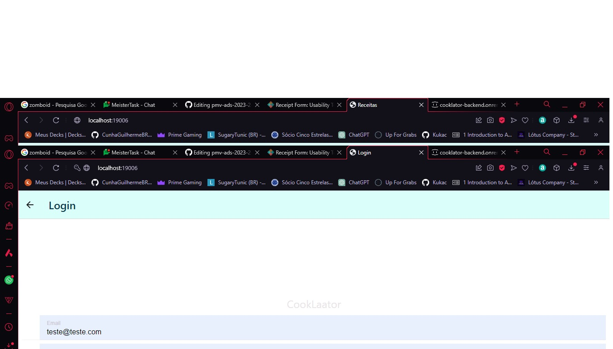

# Registro de Testes de Usabilidade

Após realizar os testes de usabilidade, obtém-se um relatório a partir das análises realizadas. O Registro de Testes de Usabilidade é um relatório que contém as evidências dos testes e relatos dos usuários participantes, baseado no Plano de Testes de Usabilidade desenvolvido para os casos de uso desta etapa.

As referências abaixo irão auxiliá-lo na geração do artefato “Registro de Testes de Usabilidade”.

> **Links Úteis**:
> - [Ferramentas de Testes de Usabilidade](https://www.usability.gov/how-to-and-tools/resources/templates.html)
>
> - Receipt Form: Usability Test Compensation (Adult)
> - **TEMPLATE**
> - [Link utilizado]([https://www.usability.gov/how-to-and-tools/resources/templates.html](https://www.usability.gov/how-to-and-tools/resources/templates/receipt-form-usability-test-compensation-adult.html))

Please sign below to indicate that you have received the promised compensation for your participation in testing today. 

Date: 12/12/2023

Amount received:00

Please print your name: Guilherme Cunha

Please sign your name: Guilherme Cunha 

A interface é simples e com o uso de alguns símbolos fica mais intuitivo ainda. O que dificulta um pouco são as cores claras, fica um pouco complicado de enxergar, mas nada a nível crítico. O projeto num todo não segue um padrão a risca de componentes, mas como o ponto anterior, nada muito crítico. Para uma entrega inicial ele cumpre muito bem os requisitos e é utilizavel com uma certa facildade. Ao passar dos tempos iria refatorar e melhorar bastante o projeto como um todo.

Test: (Cooklator) 	01/11/2023 to 12/12/2023
